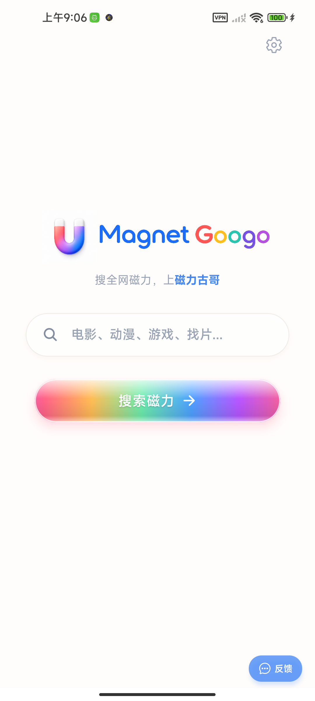
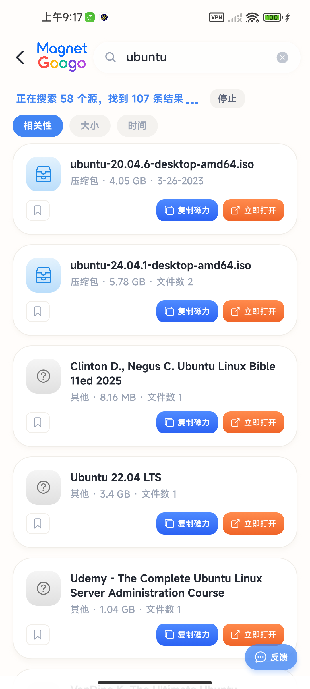

  <a href="README.md">English</a> | <strong>中文</strong>

  

<h1 align="center">磁力古哥 Magnet Googo &mdash; 聚合磁力搜索</h1>

  <strong>搜全网磁力，上磁力古哥</strong> 
  <em>免费 &middot; 无广告 &middot; 80+ 磁力源聚合搜索</em>

  
  
  
  

  <a href="https://magnetgoogo.com">官网</a> &nbsp;&middot;&nbsp;
  <a href="https://github.com/734496335/magnetgoogo/releases/latest">下载 APK</a> &nbsp;&middot;&nbsp;
  <a href="https://wwbdy.lanzoue.com/ighZS3pb0h0h">蓝奏云下载</a> &nbsp;&middot;&nbsp;
  <a href="https://naoshiquan.com/blog/">技术博客</a> &nbsp;&middot;&nbsp;
  <a href="https://github.com/734496335/magnetgoogo/issues">反馈</a>

---

## 磁力古哥是什么？

**磁力古哥 (Magnet Googo)** 是一款免费的 Android 磁力搜索聚合 App。它同时搜索全网多个磁力链接源，把电影、动漫、游戏、软件、Linux 镜像、纪录片等资源统一展示。不用再逐个翻找磁力站，一次搜索全部直达。

**核心优势：** 无广告、无弹窗、无需注册、不收集个人信息。

> 百度或 Google 搜「磁力古哥」「magnetgoogo」即可找到。

## 为什么做这个

平时找 Linux ISO、纪录片、开源资源时，要在十几个磁力索引站之间来回切——有的今天打不开，有的搜不到，有的弹窗广告满天飞。所以做了一个聚合器：输入一次，多源直达，挂掉的源自动跳过。

## 应用截图

  
  &nbsp;&nbsp;&nbsp;
  

## 功能亮点

- **全网聚合搜索** &mdash; 一次搜索 80+ 个磁力源，汇聚全网磁力资源
- **纯净无广告** &mdash; 无广告、无弹窗、无追踪、无干扰
- **一键复制** &mdash; 磁力链接一键复制，打开你喜欢的下载工具
- **隐私优先** &mdash; 搜索在本地执行，不收集任何个人信息
- **国内可用** &mdash; 无需翻墙，国内 CDN 加速

## 下载安装

| 渠道 | 链接 | 说明 |
|------|------|------|
| **GitHub Releases** | [下载最新版 APK](https://github.com/734496335/magnetgoogo/releases/latest) | 始终最新 |
| **直接下载** | [快速下载](https://cn.magnetgoogo.com/download/magnetgoogo.apk) | CDN 加速 |
| **蓝奏云** | [备用下载](https://wwbdy.lanzoue.com/ighZS3pb0h0h) | 国内用户推荐（密码: 8888） |
| **官网** | [magnetgoogo.com](https://magnetgoogo.com) | 截图和详细介绍 |

> **系统要求**：Android 7.0 及以上

## 为什么选择磁力古哥？

| 对比项 | 磁力古哥 | 单个磁力站 | 浏览器搜索 |
|--------|:---:|:---:|:---:|
| 同时搜 80+ 个源 | 是 | 否 | 否 |
| 无广告 | 是 | 否 | 否 |
| 一键复制磁力链接 | 是 | 看情况 | 否 |
| 国内可用（无需翻墙）| 是 | 看情况 | 看情况 |
| 永久免费 | 是 | 是 | 是 |

## 隐私与安全

- 所有搜索请求均在本地发起，不经过我们的服务器
- 不收集任何个人信息，没有用户账号体系
- 不要求任何敏感权限（无通讯录、无摄像头、无定位）
- 收藏和历史记录仅存储在设备本地

## 反馈与建议

欢迎在 [Issues](https://github.com/734496335/magnetgoogo/issues) 中提交 Bug 报告或功能建议，每条我们都会看。

## 相关阅读

如果你对磁力搜索的原理、磁力站为何频繁失效、独立开发感兴趣，我在 [naoshiquan.com](https://naoshiquan.com/blog/) 写了一系列技术文章：

- [2026 年最好用的 5 个磁力搜索工具](https://naoshiquan.com/blog/cili-search-tools-2026)
- [磁力链接是什么？小白完全指南](https://naoshiquan.com/blog/what-is-magnet-link)
- [磁力链接协议解析：从 BEP-9 到 DHT 网络](https://naoshiquan.com/blog/magnet-link-protocol-explained)
- [磁力猫打不开了？2026 年还能用的替代方案](https://naoshiquan.com/blog/cilimao-not-working)

## 免责声明

磁力古哥是一款搜索工具，不存储、不传播任何资源内容。搜索结果来自公开互联网，使用者应遵守当地法律法规。开发者不对搜索结果内容承担任何责任。

---

  <a href="https://magnetgoogo.com">magnetgoogo.com</a> 
  &copy; 2026 磁力古哥 Magnet Googo

