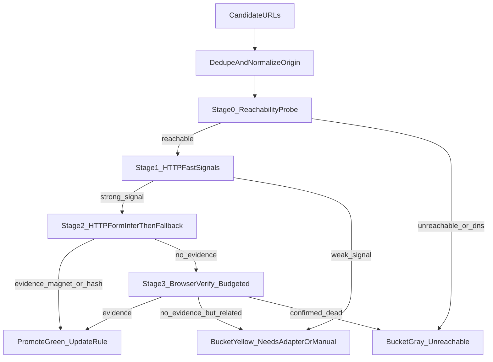

## 0. 目标（时间优先）

在**中国大陆无代理**的现实网络约束下，把“更快发现更多可用磁力源（green）”作为第一目标。

### 关键指标（按优先级）

- **TtG（Time-to-Green）**：从“新增候选域名”到“确认 green”的中位耗时
- **Green 产出率**：每 100 个候选域名最终转为 green 的数量
- **单位时间吞吐**：每小时完成的候选验证数量（Stage0/2/3 分开统计）
- **误杀率**：把仍可能可用的源错误丢进不可追踪状态的比例（用 `yellow/gray + note/diagnosis` 控制）

## 1. 总体架构：漏斗式管线（先广后深，预算驱动）

核心思想：**用漏斗替代全量重型验证**。每个阶段都有硬时间预算与早停条件，保证墙钟时间最优。



### Stage0：连通性探测（最省时、最关键）

- **目的**：在秒级把候选快速分流：可达 vs 不可达
- **手段**：`HEAD/GET /` + 重定向结果，记录基础可观测字段（仅用于分类，不做任何绕过）
- **落桶**
  - 可达 → Stage1
  - 不可达 → `gray/unreachable`（并写 `diagnosis`，避免反复浪费时间）
  - 404 → `gray/404`
  - WAF 特征（403/503 + challenge）→ `yellow/waf`

### Stage1：主页信号（值得继续吗？）

不做搜索，先用便宜信号判断“像不像磁力搜索站”。

- **强信号（进入 Stage2）**
  - 存在关键词：`magnet` / `btih` / `torrent` / `磁力` / `种子`
  - 或存在搜索表单（`<form>` + query 输入框）
- **弱信号（保留 yellow，进入适配/人工池）**
  - 疑似 JS 渲染 / 导航站 / 需要二跳才能见证据
  - 写入：`yellow/parsing_failed` + `note=weak_signal_needs_adapter_or_manual`
- **明确停放/出售/过期**
  - `gray/expired`

### Stage2：HTTP 搜索（主产线，追求最快出 green）

关键原则：**从页面表单推断优先于穷举路径**。

- **优先**：解析首页 `<form action method input name>`，生成 1-3 个最可能的请求模板
- **兜底**：少量通用模板（5-8 条即可），避免 15+ 模板导致时间爆炸
- **证据标准（升级 green）**
  - 直接 `magnet:`，或
  - 稳定提取多个 40 位 hash（建议阈值：>=3）
- **早停**
  - 任意一个 bait 命中即可停止该站的进一步尝试，立刻升级 green 并记录 `request_template`

### Stage3：浏览器验证（严格预算，只打高潜）

仅对 Stage2 未命中但 Stage1 强信号（疑似 JS）站点开启浏览器验证。

- **时间预算**：每站 20-45 秒封顶，超时回收 yellow（不要拖垮整体吞吐）
- **策略**：优先使用 Stage2 推断出的 action/template；只做有限的“轻量点击/详情页跟进”

## 2. 候选来源策略（CN 无代理的最高 ROI）

### 2.1 导航站产线（扩大候选池最有效）

导航站不是最终源，只是候选入口。正确产线是：

1) 导航站条目提取（首页/分类页）  
2) 下钻详情页  
3) **真实外链还原**（跳转/编码/中转）  
4) 得到真实域名后再走 Stage0-3

### 2.2 中国可达候选 seed

维护一份“CN 可达候选 seed 列表”，定期刷新，优先投入漏斗（Stage0）。

### 2.3 品牌复活（先过 Stage0 再投入）

品牌复活产出的候选域名必须先过可达性过滤（Stage0），否则会大量浪费墙钟时间。

## 3. 防跑偏：弱约束但必要的规范（建议强制执行）

### 规范A：契约一致性（必须）

> 任何脚本/工具写回 `sources.json` 都必须遵守。

- `health.status` **只能是**：`green|yellow|gray`
- `health.status_detail` **只能是**：`ok|healed|waf|404|expired|unreachable|parsing_failed`
- 任何更细的原因只能写进 `health.note` / `health.diagnosis`
- 每次跑批结束必须跑：`python validate_enum.py`（必须 ALL VALID）

### 规范B：时间预算（必须）

- 每个站点验证必须有 `max_seconds_per_site`（分阶段预算）
- 达到预算：停止并记录 note，不允许无限重试

### 规范C：证据升级规则（必须）

- 升级 green 必须有可提取证据：`magnet` 或 `hash>=3`
- 未确认死亡/过期/不可达的，一律落 `yellow/parsing_failed` 进入适配池（不误杀优先）

### 规范D：可观测与可复跑（建议）

- 长跑脚本必须写 `run.log`
- 每站输出一条结构化 summary（阶段、耗时、命中模板、失败原因）

## 4. 运行与验收（给实现者的最小清单）

### 输入格式

`magnet/funnel_pipeline.py --candidates <json>` 当前支持三类 JSON：

- 纯数组：
  ```json
  ["https://a.example", "https://b.example"]
  ```
- 对象 + `candidates` / `urls`：
  ```json
  {"candidates": ["https://a.example", "https://b.example"]}
  ```
- 对象 + `results`（元素可为字符串或对象）：
  ```json
  {
    "results": [
      {"real_url": "https://a.example"},
      {"url": "https://b.example"}
    ]
  }
  ```

### 推荐命令

仅跑 Stage0-2（默认主产线）：

```bash
python magnet/funnel_pipeline.py \
  --candidates mega_hunter_candidates.json \
  --out funnel_report.json \
  --summary-out funnel_summary.json
```

分批运行，控制预算：

```bash
python magnet/funnel_pipeline.py \
  --candidates btmayi_real_domains.json \
  --start 0 \
  --limit 50 \
  --stage0-timeout 3 \
  --stage2-timeout 8 \
  --max-seconds-per-site 30 \
  --stage0-concurrency 120 \
  --stage2-concurrency 40 \
  --out funnel_report.json \
  --summary-out funnel_summary.json
```

仅对高潜站开启 Stage3：

```bash
python magnet/funnel_pipeline.py \
  --candidates btmayi_real_domains.json \
  --stage3 \
  --stage3-timeout 25 \
  --stage3-concurrency 4 \
  --max-seconds-per-site 35 \
  --out funnel_report.json \
  --summary-out funnel_summary.json
```

写回 `sources.json` 并触发门禁：

```bash
python magnet/funnel_pipeline.py \
  --candidates btmayi_real_domains.json \
  --update-sources \
  --sources sources.json \
  --validate-script validate_enum.py \
  --out funnel_report.json \
  --summary-out funnel_summary.json
```

### 必须产出

- `funnel_report.json`：本次漏斗运行的逐站 verdict 与调试信息
- `funnel_summary.json`：聚合统计（Top 失败原因、阶段分布、耗时分位、green 列表）
- 可选：自动写回 `sources.json`
- `magnet/run.log`：长跑日志，便于在 IDE 中持续观察进度

### 预算参数（当前主入口已支持）

- `--start` / `--limit`：用于分批复跑
- `--stage0-timeout` / `--stage2-timeout` / `--stage3-timeout`
- `--max-seconds-per-site`
- `--stage0-concurrency` / `--stage2-concurrency` / `--stage3-concurrency`
- `--summary-top`：控制 `funnel_summary.json` 的 Top 聚合数量

### 何时开 Stage3

- **默认不开**：先用 Stage0-2 追求更快出 green
- **只在高潜站开启**：Stage1 有强信号、Stage2 无证据，但怀疑是 JS 渲染 / 轻量二跳 / 详情页跟进才能见证据
- **不要全量开启**：Stage3 是严格预算的补刀，不是主产线

### 必须门禁

- `--update-sources` 时，主流程默认自动执行 `python validate_enum.py`
- 若门禁失败，运行应报错并停止，把问题暴露到 `run.log`
- 手动复核时也必须保证：
  - `health.status` 仅 `green|yellow|gray`
  - `health.status_detail` 仅 `ok|healed|waf|404|expired|unreachable|parsing_failed`
  - 结果为 `ALL VALID`

